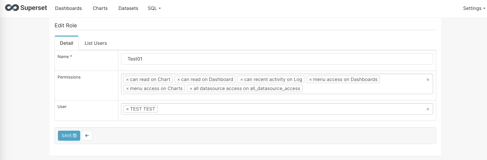

# Metabase and Superset
<!--Introduction -->
This repository is the repository for a guideline in using `metabase` and `superset` to generate the dashboard. This guideline is divided into five main points to be considered upon using either one of `metabase` or `superset`.

<!-- Table of contents -->
- [Authentication & Access control](#authentication-&-access-control)
- [Chart generation](#chart-generation)
- [Dashboard generation](#dashboard-generation)

# Installation
Both `metabase` and `superset` can be installed as a running docker container via simple CLI commands.  
- Metabase
```
docker pull metabase/metabase:latest
docker run -d -p 3000:3000 --name metabase metabase/metabase
```
- Superset
```
git clone https://github.com/apache/superset.git
cd superset
docker compose up
```

**Platform must be** *manually*  **specified in M1/M2 Mac chipsets since, in most cases, docker would not be able to identify the platform itself** The command to do so is `export DOCKER_DEFAULT_PLATFORM=linux/x86_64`

# Authentication & Access Control
Both *metabase* and *superset* are equipped with username/password authentication with its own user database. The admin user can be generated using CLI in container instance.  

For example, in supserset the admin user is created by following set of commands.

```
docker exec -it SUIPERSET_CONTATINERNAME superset fab create-admin \
              --username USERNAME \
              --firstname ADMIN_FIRSTNAME \
              --lastname ADMIN_LASTNAME \
              --email WHATEVER@ANYTHING.com \
              --password ADMIN_PASSOWRD
```
```
docker exec -it SUIPERSET_CONTATINERNAME superset db upgrade
docker exec -it SUIPERSET_CONTATINERNAME superset init
```
The first command is to generate the transaction to database to create an admin user. The second command set is for database migration (commit the transaction).

After create the user admin, admin user can create roles and users. Permission is set in the role descriptions. User permission is set upon creation by assigned roles and can be edited later.  

**Row-level security** can be implemented as well via admin account.

## Pre-defined roles
In this section, we will explore how `Superset` extensively manage roles and accesses.

### Admin
Admin account is the most prominent user in superset accounts. The **first** Admin user can be created only through the CLI inside the superset hosting instance (e.g. docker containers, VMs). Other users including *Admin* user can be created by the first admin and assign the role `admin` to that account.  

However, the admin account permission can be altered afterward to reduce risks from admin account being compromised.  
The original `admin` permission is of a superuser in other systems.  

### Public
Public role indicate the base permissions for public user. This should be defined with **least privilege principle**.

### Alpha
Alpha account pre-defined role for read/write account that are able to access and perform query and eventually generate the dashboard. We can duplicate this role and replace the datasource/database access permission to control the data access to better suit users.
### Gamma
Gamma account is read-only account. The usage of this pre-defined role is to be template for specific chart/data read.

## Permissions

### Datsource/Database
Datasource/Database permissions allows user to read on specified datasources/database. Database is as name suggested but the datasource allows access to specific *table* of *virtual(SQL) table* generated by query. User without access to the datasource will not see any dashboard even if it is published.

<!-- This needed refine -->
### Dashboard/Chart/Dataset/Query
The sets of permission regarding *Dashboard, Chart, Dataset, Query* composed of **Read** or **Write** permission.  
Dashboards and Charts are as the name suggested. However, Dataset and Query is quite contextual to situations.  

> :one: **Datasets** in supserset are the analytic-optimized *view* from the *actual table* inside the *data source* **but** with additional semantic layer. We can add calculation columns and column-based statistics to aid visualiztion as chart. Note that SQL aggregration in chart generation levels are prone to error.  


> :two: **Query** in superset is the *actual* SQL snippet to generate database transaction. The query can be saved by user with *write query* permission. Other users with *read query* permission can see all the saved queries.  


The following example role is permitted to read charts and datasets with datasets menu removed.  
*Note that `all datasource access on all_datasource_access` permission is needed for any user to see **all** published chart and dashboard*



### Database
The database can be acess with user that have `all database access on all_database_access` or its finer version `database access on [CONNECTION_NAME].(id:SOME_ID)]` which specifies permission to interact with database dubbed as `CONNECTION_NAME` with ID: `SOME_ID` generated by superset.

### Datasource
The database/datasource permission is to grant specific data access to some users. `all datasource access on all_datasource_access` permission is needed for any user to see **all** published chart and dashboard. However, each database connection and data table inside those databases have their corresponding permissions generated in superset upon connection. Permission `datasource access on [CONNECTION_NAME]` permits users to interact with datasource generated with database from `CONNECTION_NAME` while finer version of this permission is `datasource access on [CONNECTION_NAME].[SOME_TABLE](id:SOME_ID)]` where `SOME_TABLE` and `SOME_ID` are datasource referential name and ID in superset.

However, *datasource access* permissions is **sufficient** for users to view published dashboards!


# Data curation
To curate data from the known database, we need to establish connection to the sources inside the each of the programs. The process of describing the source is rather simple in both application using common things such as *Hostname, Port, Databasename, Authentication schemes and credentials.* which are all easy to find out.  

## Database access

Most known database is compatible for `metabase`[^1]and `superset`[^2]

Lastly, I will give out and example to establish the connection to Postgresql database inside the same docker *bridge-network*.

<!-- Add picture --> 
## Query
Both applications provide simple data curation from each database table after successfully establishing database connection. In case that needs transformation operation such as join, type casting, calculation, user can use **SQL** to directly read off the database.  
**Note that** *unsafe operations such as insert, update is prohibited by default and can be enabled via admin console*

<!-- Add picture example for superset --> 

# Chart generation
In this section, we go through the details in which `superset` and `metabase` chart generation process is implemented. 

<!-- Add picture example for superset --> 


# Dashboard generation
<!-- Superset example --> 

# Footnotes
[^1]: [Superset supported database](https://superset.apache.org/docs/databases/installing-database-drivers)  
[^2]: [Managing Metabase database](https://www.metabase.com/docs/latest/databases/connecting)
