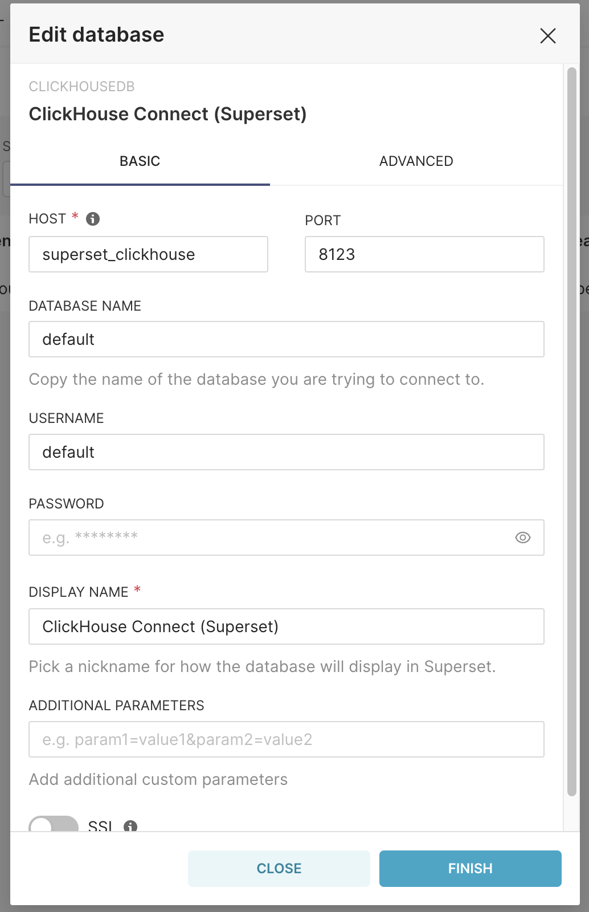

# Demo dashboard implementation notes
To generate dashboard instance for `superset` utilizing `clickhouse` as the main database, following steps are implemented.  
1. Superset/Clickhouse instance deployment
2. Superset-Clickhouse connection configuration
3. Dataset ETL into clickhouse instance
4. Clickhouse / Superset SQL configurarion
5. Clickhouse view creation
6. Chart creation  
7. Dashboard creation

The procedure listed above will be explained in details in separated sections accordingly!

# 1. Superset/Clickhouse instance deployment
In this steps, we need `superset` and `clickhouse` instance up and running. This can be either local deployment from source code or even as docker instances.  
We can use `install.sh` file to automatically pull and create and run docker instance for superset and clickhouse contatiner set with pre-installed `clickhouse-client` for superset that will be used in steps 2.

**Complete these before going onward!**
- [ ] superset succesfully deployed!
- [ ] clickhouse successfully deployed!

# 2. Superset-Clickhouse connection configuration
In this steps, we need the `clickhouse` service to be in the network reachable by `superset`. For example, in case of using clickhouse and superset in separated containers, those contatiner should be connected via docker network instance. For installation from `install.sh`, *bridge-network* is automatically assigned to both superset and clickhouse container.

### First
We need the clickhouse driver in superset environment. This can be done with easy installation via pip.  
```
pip install clickhouse-connect
```

### Second 
We create database connection from superset to clickhouse instance via sqlalchemy interface port 8123. Providing information about database you wish to use (*default* in this example) along with the host and port **8123**. You can even enable SSL connection to suit your deployment of clickhouse.
<p align="center">
  
</p>

**Complete these before going onward!**
- [ ] superset is equipped with `clickhouse-connect` python module!
- [ ] `clickhouse-connect` driver is available from database connection in superset!
- [ ] clickhouse database is reachable by superset!

# 3. Dataset ETL into clickhouse instance
In this step, we will tranform and load data to the clickhouse database. In our case, the ETL process for demo application are divided accordingly to finance team's requirements.

First, we create the data table in clickhouse instance for ETL from `.csv` files.  

**ARPT**
```sql
CREATE TABLE arpt (
  "HN" String,
  "ARNO" UInt64,
  "AN" UInt64,
  "PTTYPE" UInt32,
  "VSDATE" Date,
  "SPCFLAG" UInt32,
  "CLAIMLCT" UInt32
)
```
**ARPTINC**
```sql
CREATE TABLE arptinc (
  "ARNO" UInt64,
  "RFNDAMT" Float32,
  "CUTACTAMT" Float32,
  "INVAMT" Float32
)
```

**CLAIMLCT**
```sql
CREATE TABLE claimlct (
  "CLAIMLCT" UInt32,
  "CLAIMDSPNAME" String
)
```

**FUNPAIDINC**
```sql
CREATE TABLE funpaidinc (
  -- "ARREARNO" UInt64,
  -- "UNPAID" ,
)
```

**INCPT**
```sql
CREATE TABLE incpt (
  "HN" String,
  "AN" UInt64,
  "ARNO" UInt64,
  "ARREARNO" UInt64,
  "PTTYPE" UInt32,
  "PTTYPEEXT" UInt32,
  "INCDATE" Date,
  "SPCFLAG" UInt32,
  "INCAMT" Float32,
  "RFNDAMT" Float32,
  "RCPTAMT" Float32,
  "WELFAREAMT" Float32
)
```

**LCT**
```sql
CREATE TABLE lct (
  "WARD" UInt32,
  "NAME" String
)
```

**PTTYPEEXT**
```sql
CREATE TABLE pttypeext (
  "PTTYPEEXT" UInt32,
  "PTTYPE" UInt32,
  "NAME" String
)
```

After we create the table in clickhouse instance, we can use `clickhouse-client` to import data into clickhouse via the simple command 
```shell
clickhouse-client -q "INSERT INTO table_name FORMAT CSVWithNames" < csv_file
```


**Complete these before going onward!**
- [ ] create and populate table `arpt`
- [ ] create and populate table `arptinc`
- [ ] create and populate table `claimlct`
- [ ] create and populate table `funpaidinc`
- [ ] create and populate table `incpt`
- [ ] create and populate table `lct`
- [ ] create and populate table `pttype`
- [ ] create and populate table `pttypeext`


# 4. Clickhouse-superset SQL configuration
Inside the superset source folder, go to the file name `config.py` and open with file editor. Search for the field `SQL_MAX_ROW` and change it to whatever you want. This number represents the maximum number of SQL rows in any query from database used in analytical function.

**Complete these before going onward!**
- [ ] Edit file `config.py` at the field `SQL_MAX_ROW` to have value higher than default config.
- [ ] Check in Superset's SQL lab to verify that you can select the new upper limit you have configured.


# 5. View Creation
After we created and hydrated the clickhouse database, we **need** to create a `view` inside the clickhouse database. *We can use SQL lab inside superset to create virtual table for charts/dashboards but it is slow comparison to view utilization* 

```sql
CREATE VIEW view_name as SELECT table1.*, table2.*, table3.*
FROM table1
LEFT JOIN table2
ON table1.join_col1 = table2.join_col2
LEFT JOIN table3
ON table1.join_col2 = table2.join_col3;
```

*Complete these before going onward!**
- [ ] Create view

# 6-7 Chart and Dashboard creation
This step is quite easy. Do it yourself!

